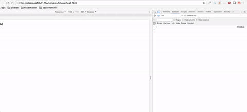

# Bookie
Bookie is a Javascript queue extension that will allow you to run scripts
in sequence and across multiple pages.

## Features

* Store scripts in a searchable list
* Name and run scripts on any page
* Pipe scripts to create workflows that span multiple pages
* Pass data from page to page using the Bookie object
* Call the next script in the queue programmatically 

## Usage

Type valid Javascript in the text field and run your command by hitting the `return` key.

Run saved scripts by clicking on them or using the `Tab` key selecting a script and hitting the `return` key.

Remove saved scripts by using the `Tab` key to select a script and hitting the `backspace` key.

## Pipe

Making a pipe means that the next script will run on the next page reload.

`alert(1); -> alert(2);`

The above script means, "alert number 1 and when the window refreshes alert 2".

Using this syntax you can create a script chain that moves from one page to another and runs one script after the other.

`alert(1); -> document.location.href="http://google.com"; -> alert(2);`

The above scripts will alert 1, go to google.com and alert 2

## References

You can create scripts that use other scripts as part of their pipe.

`#alertOne -> #goToGoogle -> #alertTwo`

The script above expects there to be 3 saved scripts with matching id's.

## Bookie api

Bookie will inject a global object called `Bookie` on each page it is loaded on.

The `Bookie` object allows you to store data and call the next script in the pipe from your scripts.

`Bookie.set(<key>, <val>)` - Sets a value on `Bookie.store` that will live until the tab closes.

`Bookie.reset()` - Removes all keys on the `Bookie` object.

`Bookie.done()` - Calls the next script in the pipe.

## Commands

### `clear` 
Remove all scripts and command history.

### `export` 
Export your saved scripts as a json file.

### `import -> <import>` 
Import a exported bookie config.

### `[id <id>] [name <name>] -> <script>` 
Save a script.

